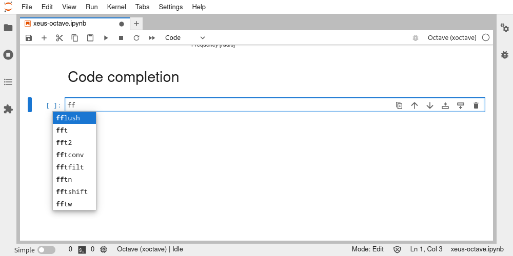
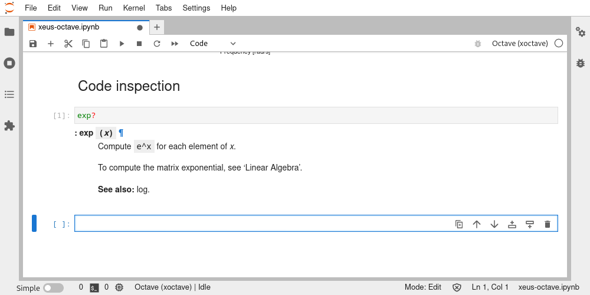
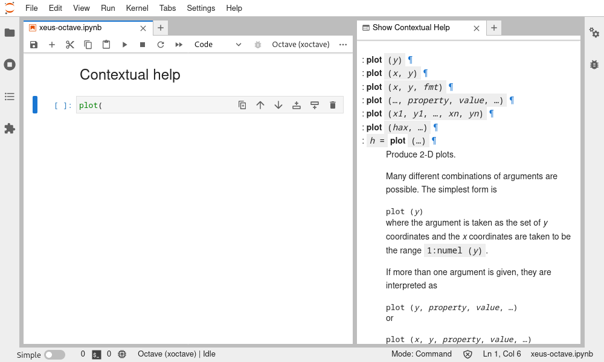
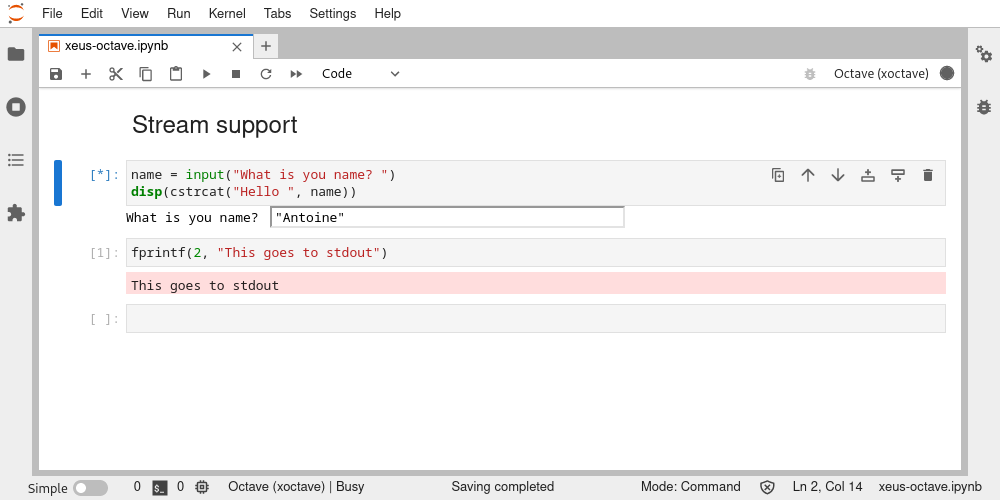
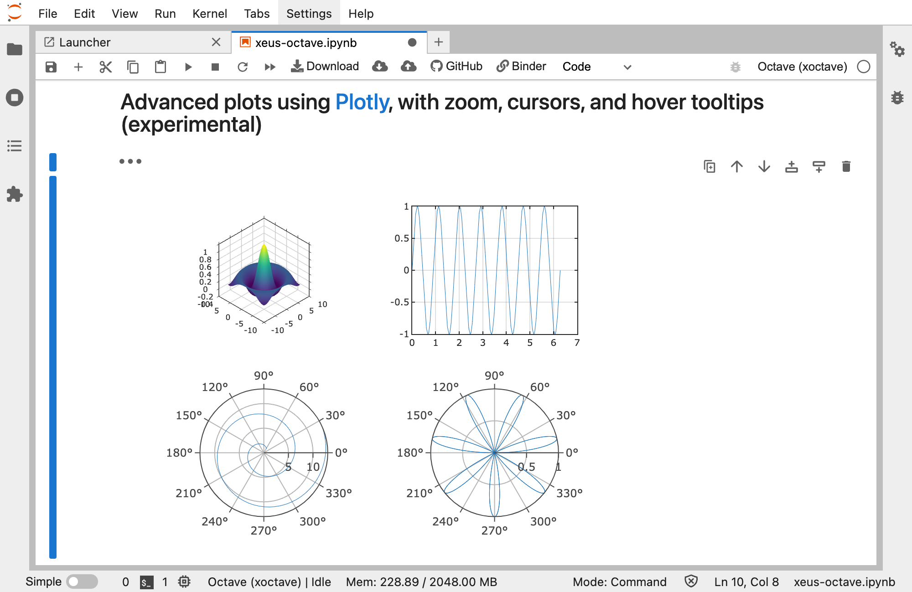
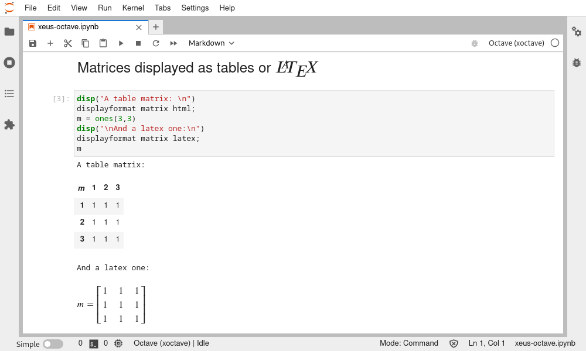
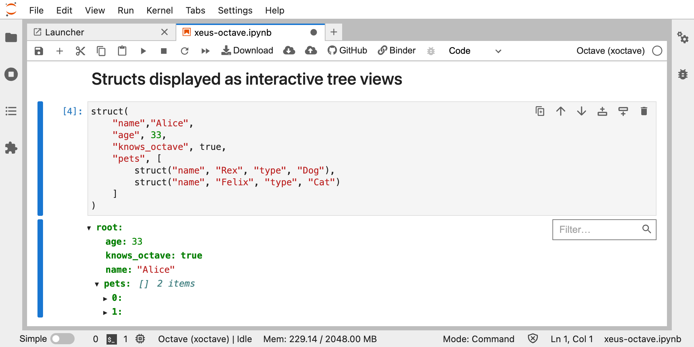
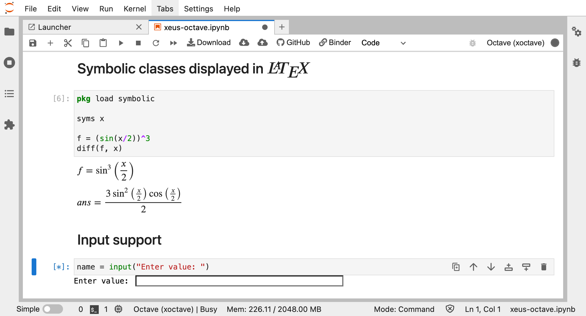
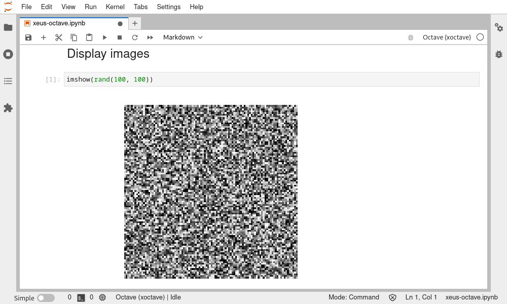

.. Copyright (c) 2020, Giulio Girardi

   Distributed under the terms of the BSD 3-Clause License.

   The full license is in the file LICENSE, distributed with this software.

.. _usage:

Usage
=====

Launch the Jupyter notebook with ``jupyter notebook`` or Jupyter lab with ``jupyter lab`` and launch
a new Python notebook by selecting the **xoctave** kernel.

Code completion
---------------

Code inspection and contextual help
-----------------------------------

Stream support
--------------

Visualisation
=============
Graphical toolkit
-----------------
*Xeus Octave* comes with two Ocatve graphical toolkit for rendering plots.

Notebook toolkit
~~~~~~~~~~~~~~~~
The ``notebook`` toolkit renders plots as inline images in the notebook.
The render is done natively using OpenGL on the kernel side.
Select this toolkit using ``graphics_toolkit notebook`` in the notebook.

.. image:: native-octave-plots.png
   :alt: Native Octave plots

Plotly toolkit
~~~~~~~~~~~~~~
The experimental ``plotly`` toolkit calls `Plotly <https://github.com/plotly/plotly.js>`_
web API to render plot as interactive HTML elements, with zoom, cursors, and hover tooltips.
Select this toolkit using ``graphics_toolkit plotly`` in the notebook.

With Jupyter lab, the plotly extension is also needed.
It can be installed with ``conda``/``mamba`` (or ``pip``)

.. code:: bash

   mamba install -c conda-forge jupyterlab plotly ipywidgets jupyter-dash

The extension is already provided with Nteract.

See `Plotly documentation <https://plotly.com/python/getting-started/>`_
for detailed instructions and troubleshooting.

Other
-----

Rich display of tables
~~~~~~~~~~~~~~~~~~~~~~

Rich display of structs
~~~~~~~~~~~~~~~~~~~~~~~

Rich display of LaTeX equations
~~~~~~~~~~~~~~~~~~~~~~~~~~~~~~~

Rich display of images
~~~~~~~~~~~~~~~~~~~~~~

